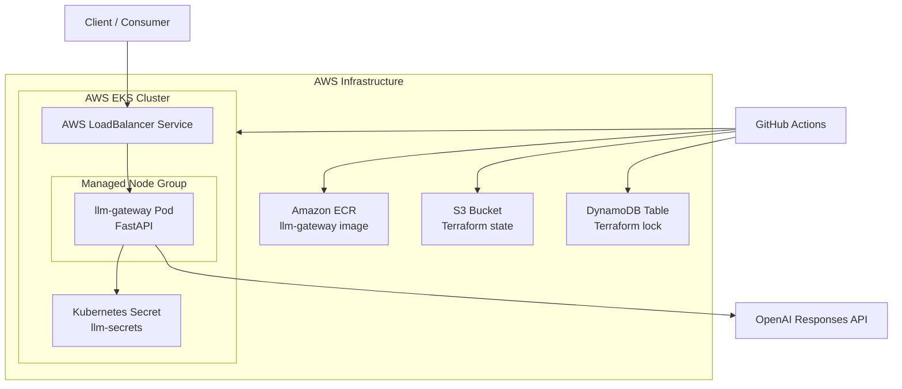
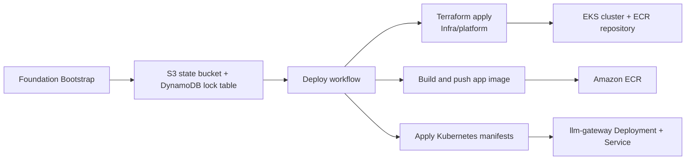
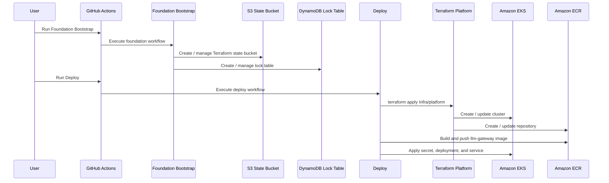
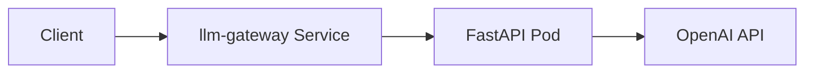

# Architecture

## System overview

The current design is a lightweight CPU-only gateway. The service does not run model inference inside the cluster. Instead, it accepts API requests, forwards prompts to OpenAI, and returns the response.

## Deployment flow

## Workflow sequence

## Simplified request flow

## Responsibility split

- `Infra/foundation`: backend state infrastructure for Terraform
- `Infra/platform`: EKS cluster and ECR repository
- `App/`: FastAPI gateway, Docker image, and Kubernetes manifests
- `.github/workflows/`: CI, bootstrap, deploy, and destroy automation

## Current runtime model

- The application runs on small CPU nodes in EKS
- Kubernetes stores `OPENAI_API_KEY` in `llm-secrets`
- The gateway calls OpenAI over HTTPS
- No local GPU inference is part of the current architecture
